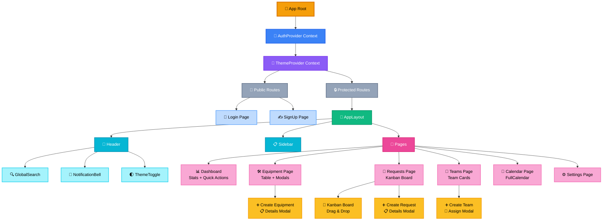
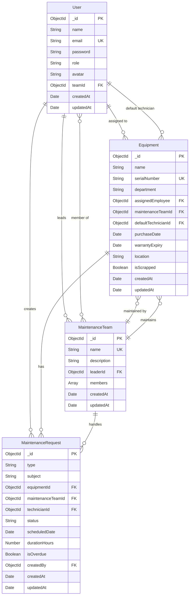
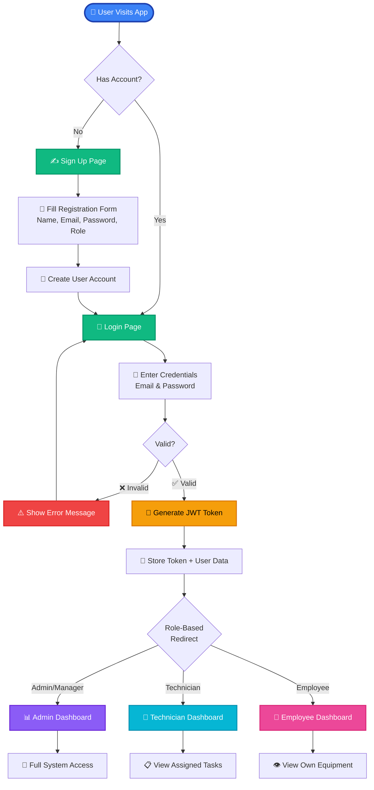
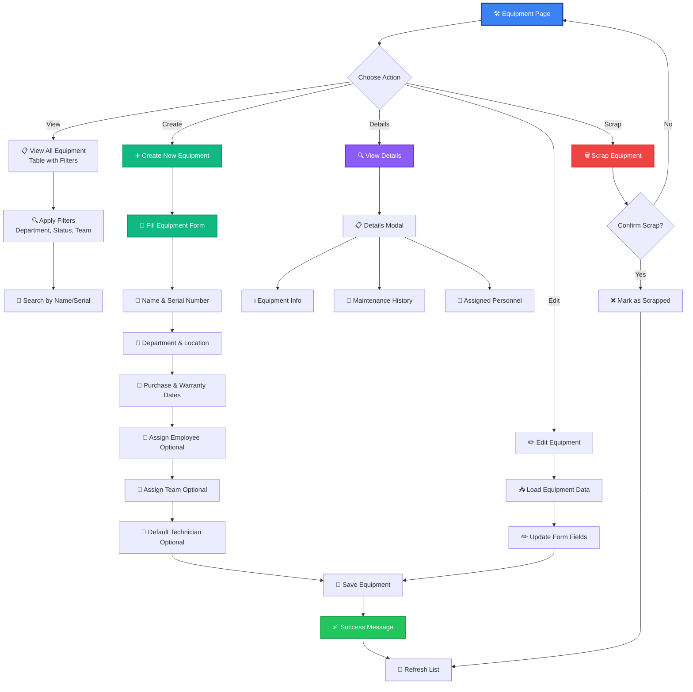
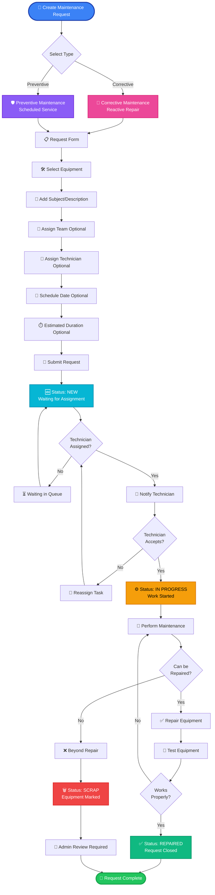
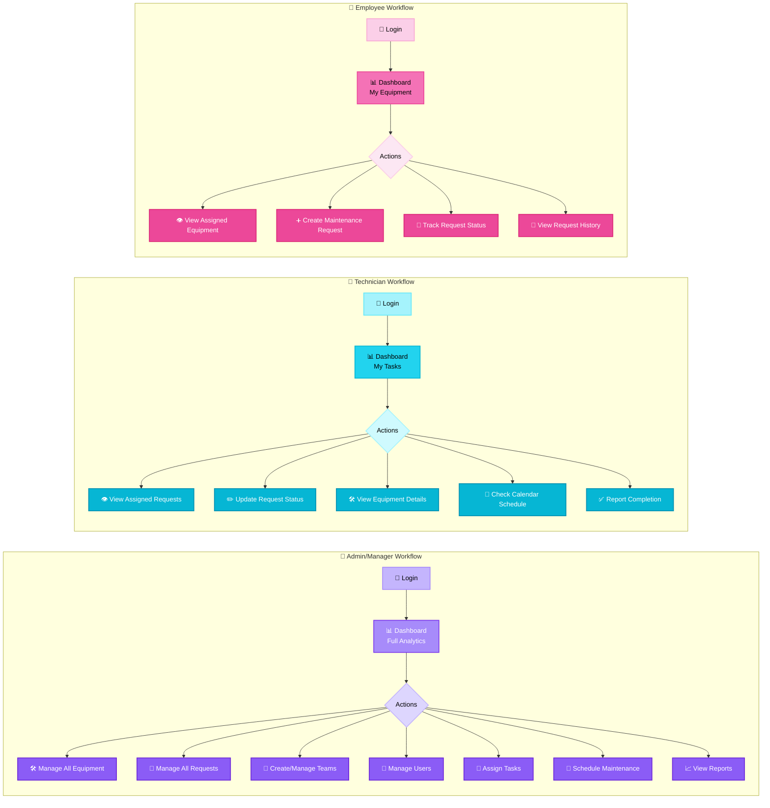
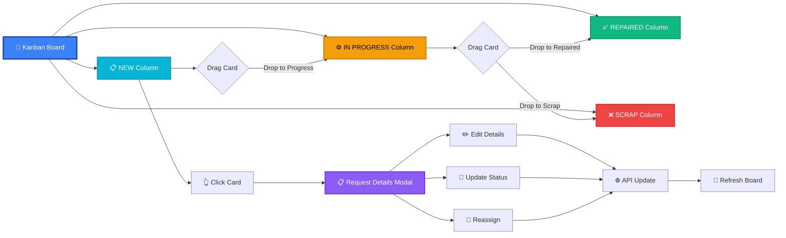

# 🛠️ YantraCare

> **Odoo x Adani University Hackathon Round 1 Project**  
> Built in 8 hours of intense hackathon development

A comprehensive Equipment Maintenance Management System designed to streamline maintenance operations, track equipment lifecycle, and manage maintenance teams efficiently.

---

## 🎯 Overview

**YantraCare** is an all-in-one equipment maintenance tracking solution that enables organizations to efficiently manage their equipment inventory, schedule preventive maintenance, handle corrective maintenance requests, and coordinate maintenance teams. Built during the Odoo x Adani University Hackathon, this system demonstrates rapid full-stack development capabilities.

### Key Objectives

- 📊 Centralized equipment tracking and lifecycle management
- 🔧 Streamlined maintenance request workflow (corrective & preventive)
- 👥 Efficient team management and task assignment
- 📅 Calendar-based maintenance scheduling
- 📈 Real-time dashboard analytics for data-driven decisions
- 🎯 Role-based access control (Admin, Manager, Technician, Employee)

---

## 💼 Use Case

### Problem Statement

Organizations face significant challenges in:
- Tracking equipment across multiple departments and locations
- Managing unplanned equipment failures and downtime
- Scheduling and tracking preventive maintenance
- Coordinating maintenance teams effectively
- Maintaining equipment warranty and lifecycle data
- Generating insights from maintenance operations

### Solution

GearGuard provides a unified platform where:

1. **Employees** can report equipment issues and track repair status
2. **Managers** can oversee all maintenance operations, assign teams, and schedule maintenance
3. **Technicians** can view assigned tasks, update repair status, and manage workload
4. **Admins** have complete system control with analytics dashboard

### Real-World Applications

- 🏭 **Manufacturing Plants**: Track production equipment and minimize downtime
- 🏫 **Educational Institutions**: Manage lab equipment, computers, and infrastructure
- 🏢 **Corporate Offices**: Maintain IT assets, HVAC systems, and office equipment
- 🏥 **Healthcare Facilities**: Track medical equipment maintenance and compliance
- 🏗️ **Construction Sites**: Manage heavy machinery and tool inventory

---

## ✨ Features

### 🔐 Authentication & Authorization
- Secure JWT-based authentication
- Role-based access control (4 roles)
- Protected routes and API endpoints

### 📊 Dashboard Analytics
- Real-time statistics overview
- Recent maintenance requests
- Upcoming scheduled maintenance
- Overdue request alerts
- Equipment health metrics
- Role-specific dashboards

### 🛠️ Equipment Management
- Complete equipment lifecycle tracking
- Serial number and department mapping
- Warranty expiry tracking
- Equipment assignment to employees
- Default technician assignment
- Equipment scrapping workflow
- Advanced filtering and search

### 📝 Maintenance Request System
- **Corrective Maintenance**: Reactive repairs for breakdowns
- **Preventive Maintenance**: Scheduled routine maintenance
- Request status workflow: New → In Progress → Repaired/Scrap
- Kanban board for visual workflow management
- Team and technician assignment
- Scheduled date and duration tracking
- Overdue request detection

### 👥 Team Management
- Create and manage maintenance teams
- Assign team leaders
- Add/remove team members
- Team-based request assignment
- Team performance tracking

### 📅 Calendar View
- Visual maintenance scheduling
- FullCalendar integration
- Color-coded event types
- Drag-and-drop rescheduling
- Monthly/weekly/daily views

### 🔍 Advanced Features
- Global search functionality
- Real-time notifications
- Dark/Light theme toggle
- Responsive mobile design
- Loading states and skeletons
- Error handling and validation

---

## 🚀 Tech Stack

### Frontend

| Technology | Purpose |
|------------|---------|
| **React 18.3** | UI library with hooks |
| **TypeScript** | Type-safe development |
| **Vite 7.3** | Fast build tool and dev server |
| **TailwindCSS 3.4** | Utility-first CSS framework |
| **Shadcn/ui** | Accessible component library |
| **React Router 6.30** | Client-side routing |
| **TanStack Query 5.83** | Server state management |
| **Axios** | HTTP client |
| **React Hook Form + Zod** | Form validation |
| **FullCalendar 6.1** | Calendar component |
| **@hello-pangea/dnd** | Drag-and-drop (Kanban) |
| **Recharts** | Data visualization |
| **Lucide React** | Icon library |
| **Sonner** | Toast notifications |

### Backend

| Technology | Purpose |
|------------|---------|
| **Node.js 18+** | Runtime environment |
| **Express 4.21** | Web framework |
| **MongoDB** | NoSQL database |
| **Mongoose 8.7** | ODM for MongoDB |
| **JWT** | Authentication tokens |
| **bcryptjs** | Password hashing |
| **CORS** | Cross-origin requests |
| **Morgan** | HTTP request logger |
| **dotenv** | Environment variables |

---

## 🏗️ Architecture

### System Architecture

```mermaid
graph TB
    subgraph Client["🖥️ Client Layer - React SPA"]
        UI["⚛️ React UI Components<br/>shadcn/ui + TailwindCSS"]
        CTX["🔄 Context Providers<br/>Auth & Theme"]
        ROUTER["🛣️ React Router<br/>Navigation"]
        API_CLIENT["📡 API Service Layer<br/>Axios + TanStack Query"]
        
        UI --> CTX
        CTX --> ROUTER
        ROUTER --> API_CLIENT
    end
    
    API_CLIENT -->|HTTP/REST + JWT| GATEWAY["🌐 API Gateway<br/>CORS + Auth Headers"]
    
    subgraph Server["⚙️ Server Layer - Node.js/Express"]
        GATEWAY --> MIDDLEWARE["🔐 Middleware Chain"]
        
        subgraph MW["Middleware Pipeline"]
            AUTH["🔑 JWT Auth"]
            ROLE["👤 Role Checker"]
            ERROR["⚠️ Error Handler"]
            CORS_MW["🌍 CORS"]
        end
        
        MIDDLEWARE --> MW
        MW --> ROUTES["📍 API Routes<br/>/auth /users /equipment<br/>/teams /requests /dashboard"]
        ROUTES --> CONTROLLERS["🎮 Controllers<br/>Business Logic Layer"]
        CONTROLLERS --> MODELS["📊 Mongoose Models<br/>Data Access Layer"]
    end
    
    MODELS -->|Query/Update| DB[("🗄️ MongoDB<br/>Database")]
    
    style UI fill:#60a5fa,stroke:#2563eb,stroke-width:2px,color:#fff
    style CTX fill:#60a5fa,stroke:#2563eb,stroke-width:2px,color:#fff
    style ROUTER fill:#60a5fa,stroke:#2563eb,stroke-width:2px,color:#fff
    style API_CLIENT fill:#3b82f6,stroke:#1e40af,stroke-width:2px,color:#fff
    style GATEWAY fill:#f59e0b,stroke:#d97706,stroke-width:2px,color:#000
    style MIDDLEWARE fill:#a78bfa,stroke:#7c3aed,stroke-width:2px,color:#fff
    style AUTH fill:#c4b5fd,stroke:#a78bfa,stroke-width:2px,color:#000
    style ROLE fill:#c4b5fd,stroke:#a78bfa,stroke-width:2px,color:#000
    style ERROR fill:#c4b5fd,stroke:#a78bfa,stroke-width:2px,color:#000
    style CORS_MW fill:#c4b5fd,stroke:#a78bfa,stroke-width:2px,color:#000
    style ROUTES fill:#a78bfa,stroke:#7c3aed,stroke-width:2px,color:#fff
    style CONTROLLERS fill:#8b5cf6,stroke:#6d28d9,stroke-width:2px,color:#fff
    style MODELS fill:#8b5cf6,stroke:#6d28d9,stroke-width:2px,color:#fff
    style DB fill:#10b981,stroke:#059669,stroke-width:3px,color:#fff
```



### Component Architecture



---

## 🗄️ Database Schema

### Collections Overview

YantraCare uses MongoDB with 4 main collections:

#### 1. Users Collection

```javascript
{
  _id: ObjectId,
  name: String,              // User's full name
  email: String,             // Unique email (lowercase)
  password: String,          // Bcrypt hashed password
  role: String,              // 'admin' | 'manager' | 'technician' | 'employee'
  avatar: String,            // Profile image URL (optional)
  teamId: ObjectId,          // Reference to MaintenanceTeam (optional)
  createdAt: Date,
  updatedAt: Date
}
```

**Indexes**: `email` (unique)

#### 2. Equipment Collection

```javascript
{
  _id: ObjectId,
  name: String,                    // Equipment name
  serialNumber: String,            // Unique serial number
  department: String,              // Department location
  assignedEmployee: ObjectId,      // Reference to User (optional)
  maintenanceTeamId: ObjectId,     // Reference to MaintenanceTeam (optional)
  defaultTechnicianId: ObjectId,   // Reference to User (optional)
  purchaseDate: Date,              // Date of purchase
  warrantyExpiry: Date,            // Warranty end date (optional)
  location: String,                // Physical location
  isScrapped: Boolean,             // Scrap status (default: false)
  createdAt: Date,
  updatedAt: Date
}
```

**Indexes**: `serialNumber` (unique)

#### 3. MaintenanceRequest Collection

```javascript
{
  _id: ObjectId,
  type: String,                    // 'corrective' | 'preventive'
  subject: String,                 // Request title/description
  equipmentId: ObjectId,           // Reference to Equipment (required)
  maintenanceTeamId: ObjectId,     // Reference to MaintenanceTeam (optional)
  technicianId: ObjectId,          // Reference to User (optional)
  status: String,                  // 'new' | 'in_progress' | 'repaired' | 'scrap'
  scheduledDate: Date,             // Scheduled maintenance date (optional)
  durationHours: Number,           // Expected duration (optional)
  isOverdue: Boolean,              // Overdue flag (default: false)
  createdBy: ObjectId,             // Reference to User (required)
  createdAt: Date,
  updatedAt: Date
}
```

#### 4. MaintenanceTeam Collection

```javascript
{
  _id: ObjectId,
  name: String,              // Unique team name
  description: String,       // Team description (optional)
  leaderId: ObjectId,        // Reference to User (optional)
  members: [ObjectId],       // Array of User references
  createdAt: Date,
  updatedAt: Date
}
```

**Indexes**: `name` (unique)

### Entity Relationships (ERD)



**Relationships:**
- **User → Equipment**: One user can be assigned to many equipment (1:N)
- **User → MaintenanceTeam**: Many-to-many relationship (members array)
- **User → MaintenanceRequest**: One user creates many requests (1:N)
- **Equipment → MaintenanceRequest**: One equipment has many requests (1:N)
- **MaintenanceTeam → Equipment**: One team maintains many equipment (1:N)
- **MaintenanceTeam → MaintenanceRequest**: One team handles many requests (1:N)

---

## 🔄 User Flow & Wireframes

### 1. Authentication Flow



### 2. Equipment Management Flow



### 3. Maintenance Request Workflow



### 4. Role-Specific Workflows



### 5. Kanban Board Interaction Flow



---

## 📁 Project Structure

### Frontend (Client/)

```
Client/
├── public/
│   └── robots.txt                    # SEO configuration
│
├── src/
│   ├── assets/                       # Static assets (images, icons)
│   │
│   ├── components/                   # React components
│   │   ├── common/                   # Shared components
│   │   │   ├── AppLayout.tsx         # Main layout wrapper
│   │   │   ├── Header.tsx            # Top navigation bar
│   │   │   ├── Sidebar.tsx           # Side navigation menu
│   │   │   ├── GlobalSearch.tsx      # Search functionality
│   │   │   ├── NotificationBell.tsx  # Notification system
│   │   │   ├── ThemeToggle.tsx       # Dark/Light mode toggle
│   │   │   ├── Badges.tsx            # Status/priority badges
│   │   │   ├── LoadingScreen.tsx     # Full-page loader
│   │   │   └── LoadingStates.tsx     # Component loaders
│   │   │
│   │   ├── CalendarView/             # Calendar component
│   │   │   ├── CalendarView.tsx      # FullCalendar integration
│   │   │   └── index.ts
│   │   │
│   │   ├── Equipment/                # Equipment features
│   │   │   ├── CreateEquipmentModal.tsx
│   │   │   ├── EquipmentDetailsModal.tsx
│   │   │   ├── CreateScheduleModal.tsx
│   │   │   ├── AssignTeamModal.tsx
│   │   │   └── index.ts
│   │   │
│   │   ├── KanbanBoard/              # Drag-drop board
│   │   │   ├── KanbanBoard.tsx       # Kanban implementation
│   │   │   └── index.ts
│   │   │
│   │   ├── Requests/                 # Request management
│   │   │   ├── RequestsPage.tsx      # Requests list view
│   │   │   ├── CreateRequestModal.tsx
│   │   │   ├── RequestDetailsModal.tsx
│   │   │   └── index.ts
│   │   │
│   │   ├── Teams/                    # Team management
│   │   │   ├── CreateTeamModal.tsx
│   │   │   └── index.ts
│   │   │
│   │   ├── ui/                       # Shadcn/ui components
│   │   │   ├── accordion.tsx
│   │   │   ├── alert-dialog.tsx
│   │   │   ├── alert.tsx
│   │   │   ├── avatar.tsx
│   │   │   ├── badge.tsx
│   │   │   ├── button.tsx
│   │   │   ├── card.tsx
│   │   │   ├── checkbox.tsx
│   │   │   ├── dialog.tsx
│   │   │   ├── dropdown-menu.tsx
│   │   │   ├── input.tsx
│   │   │   ├── label.tsx
│   │   │   ├── select.tsx
│   │   │   ├── skeleton.tsx
│   │   │   ├── table.tsx
│   │   │   ├── tabs.tsx
│   │   │   ├── toast.tsx
│   │   │   └── [30+ more components]
│   │   │
│   │   └── NavLink.tsx               # Router navigation link
│   │
│   ├── context/                      # React Context providers
│   │   ├── AuthContext.tsx           # Authentication state
│   │   └── ThemeContext.tsx          # Theme management
│   │
│   ├── hooks/                        # Custom React hooks
│   │   ├── use-mobile.tsx            # Mobile detection
│   │   └── use-toast.ts              # Toast notifications
│   │
│   ├── lib/                          # Utility libraries
│   │   ├── utils.ts                  # Helper functions
│   │   └── profileImages.ts          # Avatar utilities
│   │
│   ├── pages/                        # Page components
│   │   ├── Index.tsx                 # Landing page
│   │   ├── Login.tsx                 # Login page
│   │   ├── SignUp.tsx                # Registration page
│   │   ├── Dashboard.tsx             # Main dashboard
│   │   ├── EquipmentPage.tsx         # Equipment management
│   │   ├── RequestsPage.tsx          # Requests management
│   │   ├── TeamsPage.tsx             # Team management
│   │   ├── CalendarPage.tsx          # Calendar view
│   │   ├── AdminPage.tsx             # Admin panel
│   │   ├── SettingsPage.tsx          # User settings
│   │   └── NotFound.tsx              # 404 page
│   │
│   ├── routes/                       # Route protection
│   │   └── ProtectedRoute.tsx        # Auth guard
│   │
│   ├── services/                     # API services
│   │   └── api.ts                    # Axios API client (531 lines)
│   │
│   ├── types/                        # TypeScript definitions
│   │   └── index.ts                  # Type declarations
│   │
│   ├── App.tsx                       # Root component
│   ├── main.tsx                      # Entry point
│   └── index.css                     # Global styles
│
├── components.json                   # Shadcn config
├── tailwind.config.ts                # Tailwind configuration
├── vite.config.ts                    # Vite configuration
├── tsconfig.json                     # TypeScript config
├── package.json                      # Dependencies
└── README.md                         # This file
```

### Backend (Server/)

```
Server/
├── config/
│   └── db.js                         # MongoDB connection
│
├── controllers/                      # Route handlers
│   ├── auth.controller.js            # Authentication logic
│   ├── user.controller.js            # User CRUD operations
│   ├── equipment.controller.js       # Equipment management
│   ├── request.controller.js         # Request handling
│   ├── team.controller.js            # Team management
│   └── dashboard.controller.js       # Analytics & stats
│
├── middlewares/                      # Express middleware
│   ├── auth.middleware.js            # JWT verification
│   ├── role.middleware.js            # Role-based access
│   └── error.middleware.js           # Error handling
│
├── models/                           # Mongoose schemas
│   ├── User.js                       # User model
│   ├── Equipment.js                  # Equipment model
│   ├── MaintenanceRequest.js         # Request model
│   └── MaintenanceTeam.js            # Team model
│
├── routes/                           # API routes
│   ├── auth.routes.js                # /api/auth/*
│   ├── user.routes.js                # /api/users/*
│   ├── equipment.routes.js           # /api/equipment/*
│   ├── request.routes.js             # /api/requests/*
│   ├── team.routes.js                # /api/teams/*
│   └── dashboard.routes.js           # /api/dashboard/*
│
├── utils/                            # Helper utilities
│   ├── ApiError.js                   # Custom error class
│   └── asyncHandler.js               # Async wrapper
│
├── server.js                         # Express app entry
├── package.json                      # Dependencies
└── .env                              # Environment variables (not in repo)
```

---

## 🛠️ Installation

### Prerequisites

- **Node.js** >= 18.0.0
- **npm** or **bun**
- **MongoDB** (local or Atlas)

### Environment Variables

Create `.env` file in `Server/` directory:

```env
# Server Configuration
PORT=4000
NODE_ENV=development

# Database
MONGODB_URI=mongodb://localhost:27017/yantracare
# Or for MongoDB Atlas:
# MONGODB_URI=mongodb+srv://<username>:<password>@cluster.mongodb.net/yantracare

# JWT Configuration
JWT_SECRET=your_super_secret_jwt_key_here_change_this_in_production
JWT_EXPIRES_IN=7d

# CORS
CORS_ORIGIN=http://localhost:5173
```

Create `.env` file in `Client/` directory:

```env
VITE_API_URL=http://localhost:4000/api
```

### Installation Steps

#### 1. Clone Repository

```bash
git clone <repository-url>
cd YantraCare
```

#### 2. Install Backend Dependencies

```bash
cd Server
npm install
```

#### 3. Install Frontend Dependencies

```bash
cd ../Client
npm install
# or if using bun:
bun install
```

#### 4. Start MongoDB

```bash
# If using local MongoDB:
mongod

# If using MongoDB Atlas, ensure your connection string is correct in .env
```

#### 5. Start Backend Server

```bash
cd Server
npm run dev
# Server will run on http://localhost:4000
```

#### 6. Start Frontend Development Server

```bash
cd Client
npm run dev
# Client will run on http://localhost:5173
```

#### 7. Access Application

Open browser and navigate to: `http://localhost:5173`

### Default Login Credentials

After first run, you can create an admin account via signup or use seed data if provided.

```
Email: admin@example.com
Password: admin123
Role: admin
```

---

## 🔌 API Endpoints

### Authentication Routes (`/api/auth`)

| Method | Endpoint | Description | Auth Required |
|--------|----------|-------------|---------------|
| POST | `/register` | Register new user | No |
| POST | `/login` | User login | No |
| GET | `/me` | Get current user | Yes |

### User Routes (`/api/users`)

| Method | Endpoint | Description | Auth Required | Roles |
|--------|----------|-------------|---------------|-------|
| GET | `/` | Get all users | Yes | Admin, Manager |
| GET | `/:id` | Get user by ID | Yes | All |
| PATCH | `/:id` | Update user | Yes | Admin, Self |
| DELETE | `/:id` | Delete user | Yes | Admin |

### Equipment Routes (`/api/equipment`)

| Method | Endpoint | Description | Auth Required | Roles |
|--------|----------|-------------|---------------|-------|
| GET | `/` | Get all equipment (with filters) | Yes | All |
| GET | `/:id` | Get equipment by ID | Yes | All |
| POST | `/` | Create equipment | Yes | Admin, Manager |
| PATCH | `/:id` | Update equipment | Yes | Admin, Manager |
| DELETE | `/:id` | Delete equipment | Yes | Admin |
| PATCH | `/:id/scrap` | Mark as scrapped | Yes | Admin, Manager |

### Request Routes (`/api/requests`)

| Method | Endpoint | Description | Auth Required | Roles |
|--------|----------|-------------|---------------|-------|
| GET | `/` | Get all requests (with filters) | Yes | All |
| GET | `/:id` | Get request by ID | Yes | All |
| POST | `/` | Create request | Yes | All |
| PATCH | `/:id` | Update request | Yes | Admin, Manager, Assigned Tech |
| PATCH | `/:id/status` | Update status only | Yes | Admin, Manager, Assigned Tech |
| DELETE | `/:id` | Delete request | Yes | Admin, Creator |

### Team Routes (`/api/teams`)

| Method | Endpoint | Description | Auth Required | Roles |
|--------|----------|-------------|---------------|-------|
| GET | `/` | Get all teams | Yes | All |
| GET | `/:id` | Get team by ID | Yes | All |
| POST | `/` | Create team | Yes | Admin, Manager |
| PATCH | `/:id` | Update team | Yes | Admin, Manager, Team Leader |
| DELETE | `/:id` | Delete team | Yes | Admin |
| POST | `/:id/members` | Add member | Yes | Admin, Manager, Team Leader |
| DELETE | `/:id/members/:userId` | Remove member | Yes | Admin, Manager, Team Leader |

### Dashboard Routes (`/api/dashboard`)

| Method | Endpoint | Description | Auth Required |
|--------|----------|-------------|---------------|
| GET | `/stats` | Get dashboard statistics | Yes |
| GET | `/recent-requests` | Get recent maintenance requests | Yes |
| GET | `/calendar-events` | Get calendar events | Yes |

---

## 📸 Screenshots

### Dashboard
![Dashboard showing real-time statistics, recent requests, and quick actions]

### Equipment Management
![Equipment list with filters, search, and CRUD operations]

### Kanban Board
![Drag-and-drop Kanban board for request workflow management]

### Calendar View
![FullCalendar showing scheduled maintenance with color coding]

### Team Management
![Team cards showing members, leader, and team statistics]

### Mobile Responsive
![Responsive design working seamlessly on mobile devices]

---

## 👥 Team

Built with ❤️ during **Odoo x Adani University Hackathon Round 1**

**Development Time**: 8 hours  
**Hackathon**: Odoo x Adani University  
**Round**: 1

---

## 📄 License

This project was created for the Odoo x Adani University Hackathon.

---

## 🙏 Acknowledgments

- **Odoo & Adani University** for organizing the hackathon
- **Shadcn/ui** for the amazing component library
- **FullCalendar** for calendar functionality
- **MongoDB** for the flexible database solution
- Open source community for all the incredible tools

---

## 📞 Support

For any queries or issues, please contact the development team.

---

**Made with speed and precision in 8 hours! ⚡**
